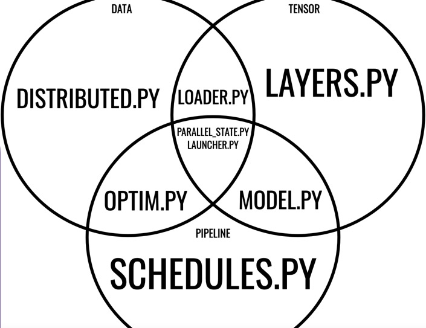

# starscream

A toy version of NVIDIA's `Megatron` [project](https://github.com/nvidia/megatron-lm).
Specifically, multiprocessing and distributed techniques are used to implement tensor model, pipeline model, and data parallelism.
These techniques are informed by several NVIDIA research articles ([1](https://arxiv.org/abs/1909.08053), [2](https://arxiv.org/abs/2104.04473), and [3](https://arxiv.org/abs/2205.05198)).

The parallelism in Starscream's design can be understood with the following diagram:

To understand the implementation, it is most useful to begin with parallel_state.py in the center. Then, proceed to the individual parallel strategies in distributed.py, layers.py, and schedules.py. Finally, study the composite objects in loader.py, optim.py, and model.py.
To see a demonstration of Starscream's (somewhat limited) capabilities, run launcher.py on CPU.
